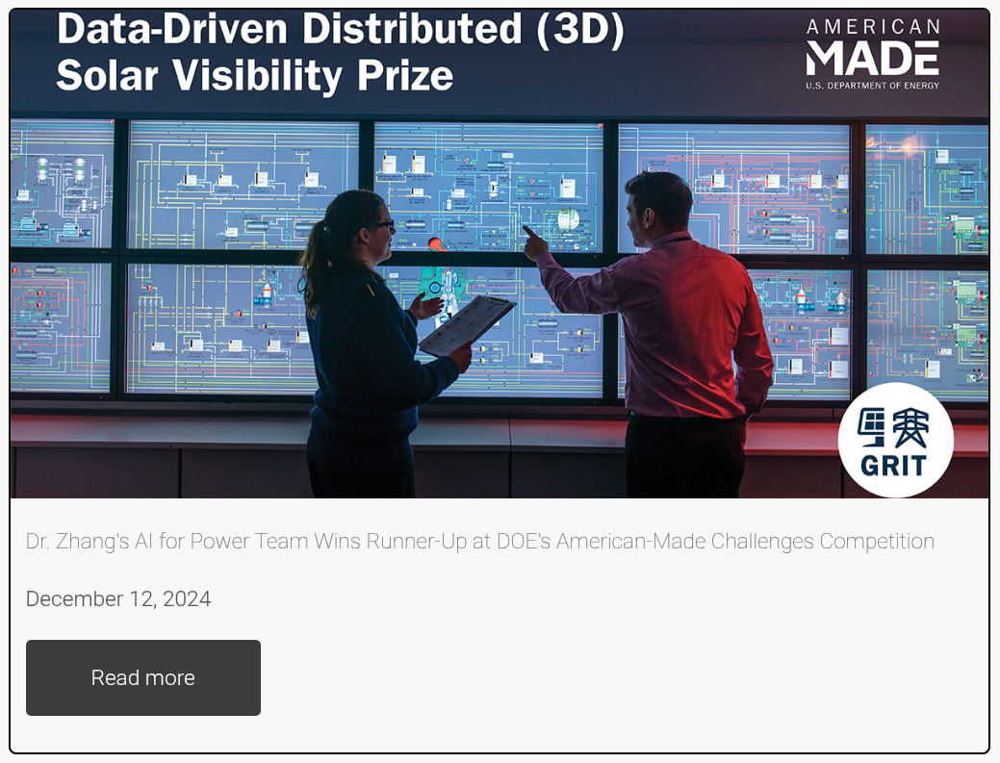

# DigiCARES Adding Content

For most content, creating a new file in the respective `_collection` folder
will be sufficient. The file name should be in the format `YYYY-MM-DD-title.md`.
To save drafts to the upstream repository, place the file in
`_collection/_drafts/` instead, and use `draft: true` in the front matter. For
example, a news post that has been saved as a draft but not seen on the deployed
site would be in `_news/_drafts/2023-01-01-title.md` with the following content:

```yaml
---
title: "Title"
date: 2023-01-01
more: https://example.com
draft: true
---

Content goes here.
```

## News Posts

To add a news post, create a new file in the `_news` folder with the following
front matter:

```yaml
---
title: "Title"
date: YYYY-MM-DD
image: /images/news/image.png
more: https://example.com
---
```

Below the final `---`, add the content of the news post. The content can be in
Markdown format, plain text, or HTML.

`title` is the title of the news post as seen in the first header.

`date` is the date of the news post in the format `YYYY-MM-DD`; posts will be
ordered by date first, then title.

`image` is the path to the image to be displayed in the news post. The image
should be place under `images/news/` to be served with the site. Any standard
image format may be used, however, it is reccomended to use `.png` or `.jpg`.
This attribute is *optional*. If ommitted, a plugin will attempt to find an
image in the provided link using the OpenGraph protocol. Likewise, if provided,
it will override the OpenGraph image.

`more` is the link to the full news post. This is *optional*; if omitted, the
"Read More" button will not be displayed.

### Example

```yaml
---
title: Dr. Zhang's AI for Power Team Wins Runner-Up at DOE's American-Made Challenges Competition
date: 2024-12-12
more: https://ceat.okstate.edu/announcements/ece/2024/zhangs-ai-for-power-team-won-runner-up-at-does-american-made-challenges-competition.html
---
```

<details>
    <summary>Click here to view the example post rendered:</summary>

    
</details>

## Publications

Publications have not yet moved to a collections format yet. To add a
publication edit the markdown file in `pages/resources/publications_section.md`.
Use markdown to add a new publication to the list. Markdown will automatically
correct numbers when an ordered list (numbered list) is used with all ones. To
add a link, add a link reference to the bottom of the file.

Use the following format to add a reference:

```markdown
 1. Author, A., Author, B., Author, C. (2024). Title of the paper. Journal of
    Example, 1(1), 1-10. [Link.][n]
```

Then, to add the link reference, add the following to the bottom of the file:

```markdown
[n]: https://example.com
```

If there is not a link, or you would like to ommit it, remove the link reference
and `[Link.][1]` from the publication listing. Note, you will need to change `n`
to the next available number.

## Team Members

Much like the news posts, team members are added by creating a new file in the
`_team` folder. The file name should be in the format `name.md`. The front
matter has many attributes. Either copy the `example-professor.md` file and
modify it, or use the following template:

```yaml
---
################################################################################
# This is an example of a members's profile.                                   #
#                                                                              #
# Copy this file within this directory and rename it to your name. Then fill   #
# out each field as required. Note that not every field needs to be filled out.#
# For example, if you don't have a website, you can leave the more_text and    #
# more_url fields blank. Finally, remove the hidden field to make your profile #
# visible.                                                                     #
################################################################################
# Change this to your name
name: Example Professor
post-nominal: Ph.D.
# The type field is used to place you under the correct subheading. It may be of
# the following values: researcher, postdoc, visiting_scholar, graduate,
# undergraduate, or other.
type: researcher
# Bio-tags: the following describe the person's role in the research.
institution: New Mexico State University
title: Researcher
# Optional tag to change the display order in relation to other professors
# To sort by universities chang this on each person to match their
# institution as such, with each n being any number from 00-99.
# NMSU - 5nn
# MSU - 7nn
# OSU - 10nn
# UAH - 15nn
# NSF - 20nn
sort_order: 1001
# Be sure to place this image in the /images/profiles/ directory.
image: example.svg
# Include a link to an external website, or some other internal page if desired.
# If not including a link, delete both fields or leave them blank.
more_text: Example's Website
more_url: https://example.com/
# Delete this command and field below when finished.
hidden: true
---

Include some text here to have it display under your name.
```


[1]: https://github.com/DigiCARES/website/blob/main/_showcase/news_example.png

